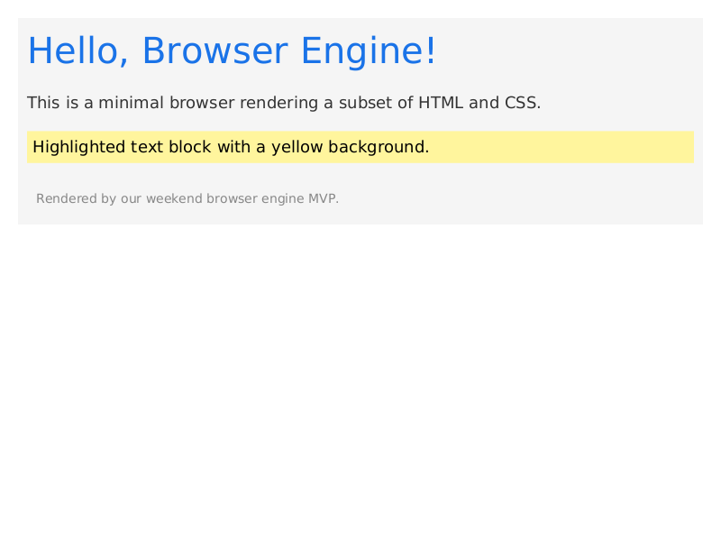
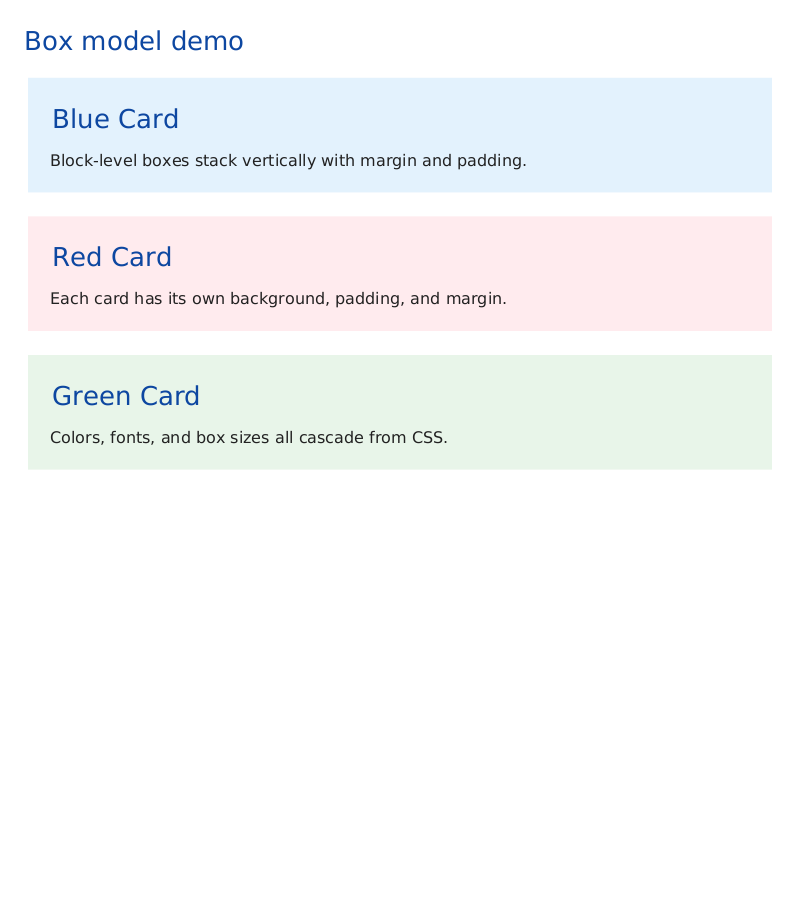
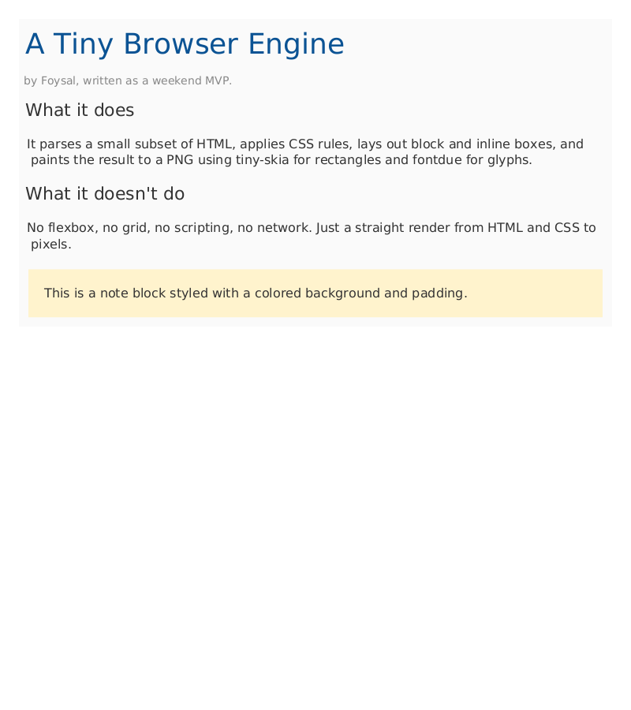

# Browser Engine

**Stack:** Rust · `html5ever` (study then replace) · custom CSS parser (`cssparser` crate) · `tiny-skia` or `wgpu` for painting · QuickJS (via `rquickjs`) for JS · `hyper` for network · Servo as reference

## Full Vision
HTML5 parser, CSS 3 cascade, flexbox + grid, compositor, JS engine integration, network stack, service workers, top-1000 sites render correctly.

## MVP (1 weekend)
Parse HTML → DOM → block layout → paint text+boxes to PNG. Supports `color`, `background-color`, `margin`, `padding`, `font-size`, `width`, `height`, `display:block|inline|none`.

## MVP Status — SHIPPED

The MVP lives in [`mvp/`](./mvp). It renders a subset of HTML + CSS directly to a PNG — no browser, no window, just pixels.

Pipeline:

```
HTML text
  → html.rs     (hand-rolled tokenizer → DOM)
  → css.rs      (selectors: tag/id/class, color/length/keyword values)
  → style.rs    (selector matching + specificity + UA stylesheet)
  → layout.rs   (block-flow box model + line-wrapped inline text)
  → paint.rs    (tiny-skia rectangles + fontdue glyph coverage blits)
  → output.png
```

### Build & run

```bash
cd mvp
cargo build --release
./target/release/browser-engine-mvp samples/hello.html samples/hello.png 800 600
```

Font is bundled (DejaVu Sans). Override with `BROWSER_FONT=/path/to/font.ttf`.

### Sample renders

| Input | Output |
|------|--------|
| [`samples/hello.html`](./mvp/samples/hello.html) |  |
| [`samples/boxes.html`](./mvp/samples/boxes.html) |  |
| [`samples/article.html`](./mvp/samples/article.html) |  |

### What works
- Tags: `html`, `body`, `div`, `h1–h3`, `p`, `span`, `ul`, `li`, `a`, plus `<style>` and `<!DOCTYPE>` / comments
- Attributes: `id`, `class`, inline `style=""`
- Selectors: tag, `.class`, `#id`, compound (`h1.title`), comma lists
- Specificity-ordered cascade + user-agent stylesheet
- Block layout: `margin`, `padding`, `width`, `height`, vertical stacking
- Inline layout: text wrapping on line boxes, per-word break
- Paint: solid background rectangles, glyph coverage blit with source-over alpha

### What doesn't work yet
- No flexbox, grid, floats, tables, absolute positioning
- No borders, border-radius, box-shadow, images
- No scripting, no network, no forms, no events
- No font selection / weight / italic — single TTF only
- Only `px` lengths (no `em`, `%`, `rem`)

## Milestones
- **M1 (Week 2):** HTML parser + DOM tree + CSS parser + selector matching — **DONE in MVP**
- **M2 (Week 5):** Block + inline layout + painting to canvas/window — **block + inline done; window pending**
- **M3 (Week 10):** Flexbox + broader CSS property set + fonts (harfbuzz)
- **M4 (Week 16):** JS engine (QuickJS) + DOM bindings + events
- **M5 (Week 24):** Network stack (HTTPS) + renders 10 real websites

## Key References
- "Let's build a browser engine!" (Matt Brubeck)
- Servo architecture
- CSS 2.1 spec
