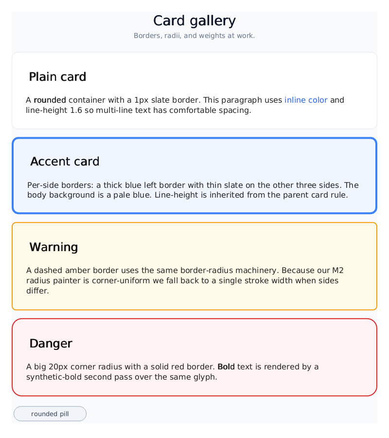
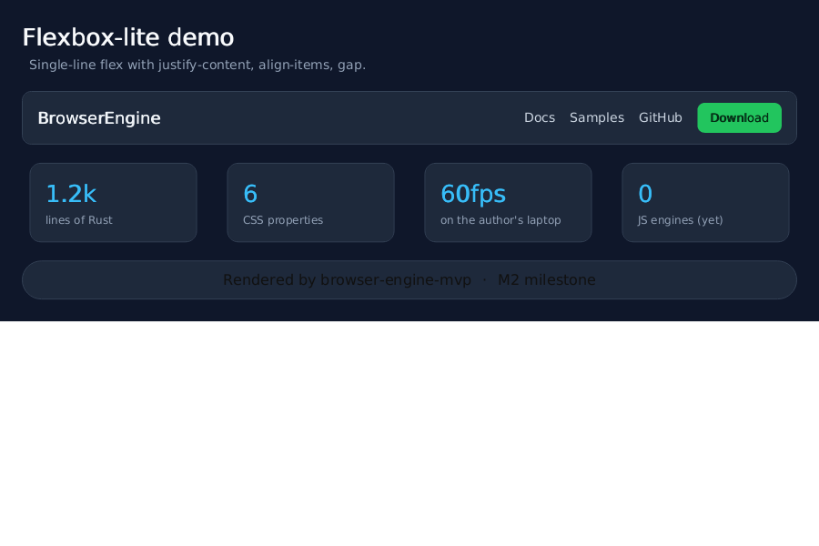

# Browser Engine

**Stack:** Rust · `html5ever` (study then replace) · custom CSS parser (`cssparser` crate) · `tiny-skia` or `wgpu` for painting · QuickJS (via `rquickjs`) for JS · `hyper` for network · Servo as reference

## Full Vision
HTML5 parser, CSS 3 cascade, flexbox + grid, compositor, JS engine integration, network stack, service workers, top-1000 sites render correctly.

## MVP (1 weekend)
Parse HTML → DOM → block layout → paint text+boxes to PNG. Supports `color`, `background-color`, `margin`, `padding`, `font-size`, `width`, `height`, `display:block|inline|none`.

## MVP Status — SHIPPED

The MVP lives in [`mvp/`](./mvp). It renders a subset of HTML + CSS directly to a PNG — no browser, no window, just pixels.

Pipeline:

```
HTML text
  → html.rs     (hand-rolled tokenizer → DOM)
  → css.rs      (selectors: tag/id/class, color/length/keyword values)
  → style.rs    (selector matching + specificity + UA stylesheet)
  → layout.rs   (block-flow box model + line-wrapped inline text)
  → paint.rs    (tiny-skia rectangles + fontdue glyph coverage blits)
  → output.png
```

### Build & run

```bash
cd mvp
cargo build --release
./target/release/browser-engine-mvp samples/hello.html samples/hello.png 800 600
```

Font is bundled (DejaVu Sans). Override with `BROWSER_FONT=/path/to/font.ttf`.

### Sample renders

| Input | Output |
|------|--------|
| [`samples/hello.html`](./mvp/samples/hello.html) |  |
| [`samples/boxes.html`](./mvp/samples/boxes.html) |  |
| [`samples/article.html`](./mvp/samples/article.html) |  |
| [`samples/cards.html`](./mvp/samples/cards.html) |  |
| [`samples/flex.html`](./mvp/samples/flex.html) |  |

### What works
- Tags: `html`, `body`, `div`, `h1–h3`, `p`, `span`, `ul`, `li`, `a`, plus `<style>` and `<!DOCTYPE>` / comments
- Attributes: `id`, `class`, inline `style=""`
- Selectors: tag, `.class`, `#id`, compound (`h1.title`), comma lists
- Specificity-ordered cascade + user-agent stylesheet
- Block layout: `margin`, `padding`, `width`, `height`, vertical stacking
- Inline layout: text wrapping on line boxes, per-word break
- Paint: solid background rectangles, glyph coverage blit with source-over alpha

### What doesn't work yet
- No grid, floats, tables, absolute positioning
- No box-shadow, images
- No scripting, no network, no forms, no events
- No real font selection / italic — single TTF with synthetic bold
- Only `px` lengths (no `em`, `%`, `rem`)

## M2 Status — SHIPPED

Richer layout + CSS. The engine now does enough to render realistic
card UIs and nav/hero flex layouts.

New in M2:
- **Borders** — `border`, `border-top`/`right`/`bottom`/`left`,
  `border-width`/`-color`/`-style`, shorthand parsing of `1px solid #333`.
  Borders sit in the box model between padding and margin and are painted
  per-side (or as a single stroke when a radius is present).
- **`border-radius`** — 1–4 values, per-corner. Backgrounds and borders
  clip to a cubic-Bezier rounded rect.
- **Flexbox-lite (`display: flex`)** — single-line. Supports
  `flex-direction: row|column`, `justify-content:
  flex-start|flex-end|center|space-between|space-around|space-evenly`,
  `align-items: flex-start|center|flex-end`, and `gap`. Flex children
  without an explicit `width` shrink to fit their content.
- **Inline layout fixes** — per-line baseline tracking so mixed-size
  inline text aligns on the baseline, whitespace collapsing that
  preserves inter-element spaces (`<strong>A</strong> b` → "A b"),
  trailing-whitespace trimming at line breaks.
- **`text-align: left|center|right`** and **`line-height`** (unitless
  multiplier or length) on block containers with inline content.
- **`font-weight`** — `bold` / numeric ≥ 600, defaults for `<b>`,
  `<strong>`, `<h1>`–`<h6>`. Synthetic-bold second pass so the bundled
  single-weight TTF still looks bold.
- **Colors** — `#rgb` / `#rrggbb` / `#rrggbbaa`, `rgb()` / `rgba()`,
  and a greatly expanded named-color table.

New samples:
- [`samples/cards.html`](./mvp/samples/cards.html) — card gallery
  exercising borders, per-side borders, dashed/solid borders, rounded
  corners, pills, bold, inline colors, line-height.
- [`samples/flex.html`](./mvp/samples/flex.html) — navbar, stats
  row and footer built with `display: flex`, `justify-content`,
  `align-items`, and `gap`.

## Milestones
- **M1 (Week 2):** HTML parser + DOM tree + CSS parser + selector matching — **DONE in MVP**
- **M2 (Week 5):** borders, border-radius, flexbox-lite, inline-layout fixes — **DONE**
- **M3 (Week 10):** Grid + broader CSS property set + real font weights (harfbuzz)
- **M4 (Week 16):** JS engine (QuickJS) + DOM bindings + events
- **M5 (Week 24):** Network stack (HTTPS) + renders 10 real websites

## Key References
- "Let's build a browser engine!" (Matt Brubeck)
- Servo architecture
- CSS 2.1 spec
