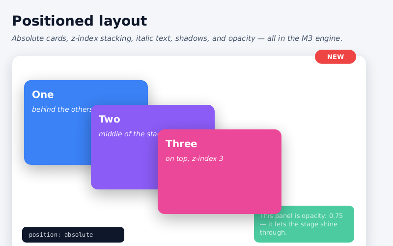
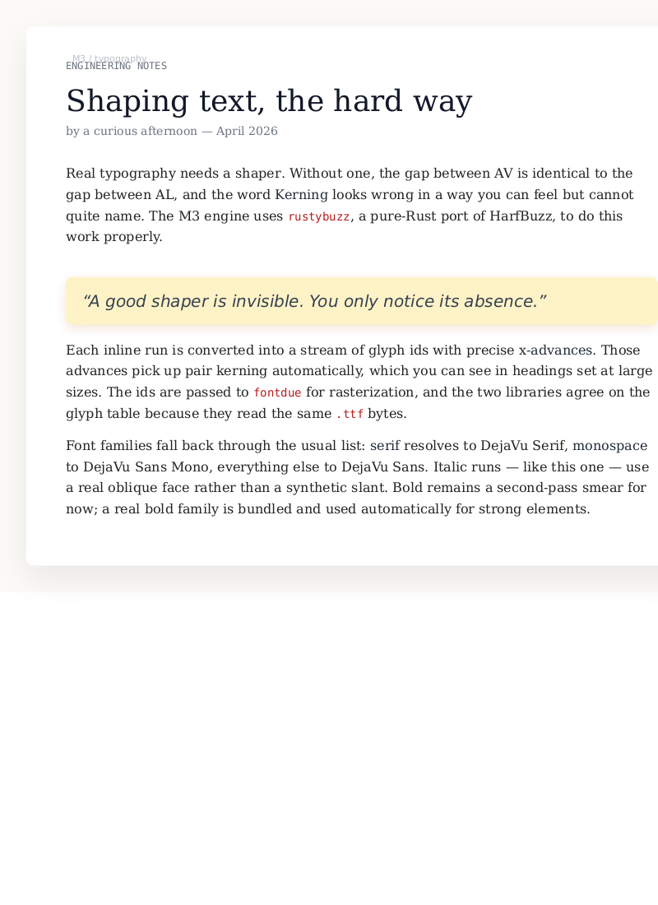
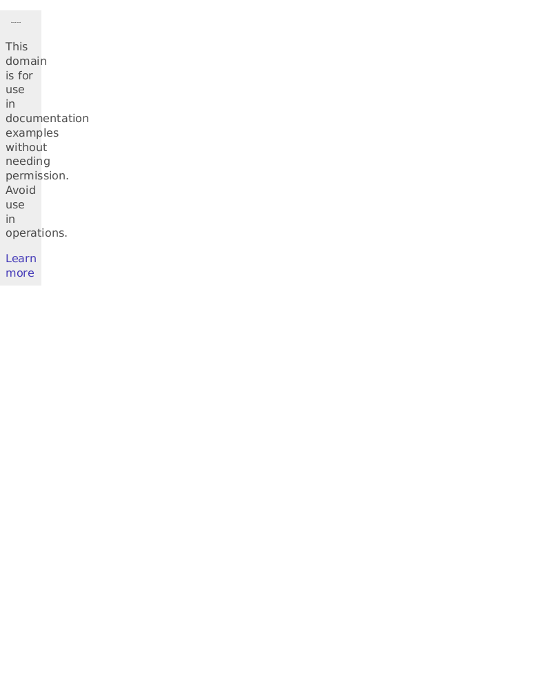
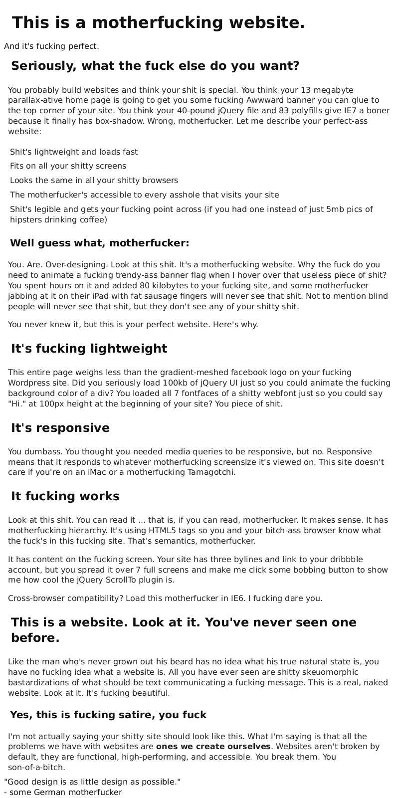
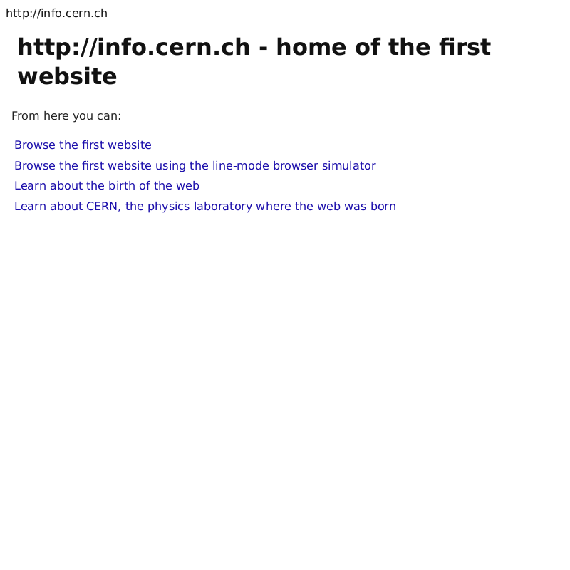
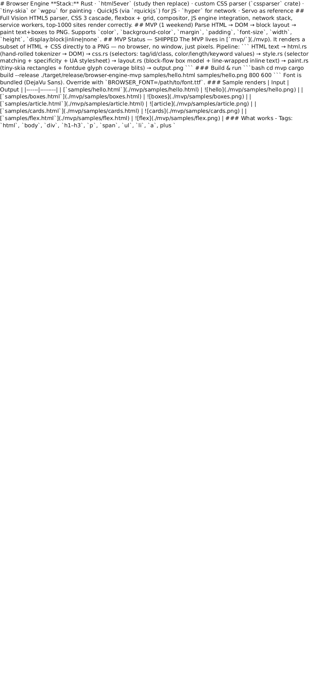
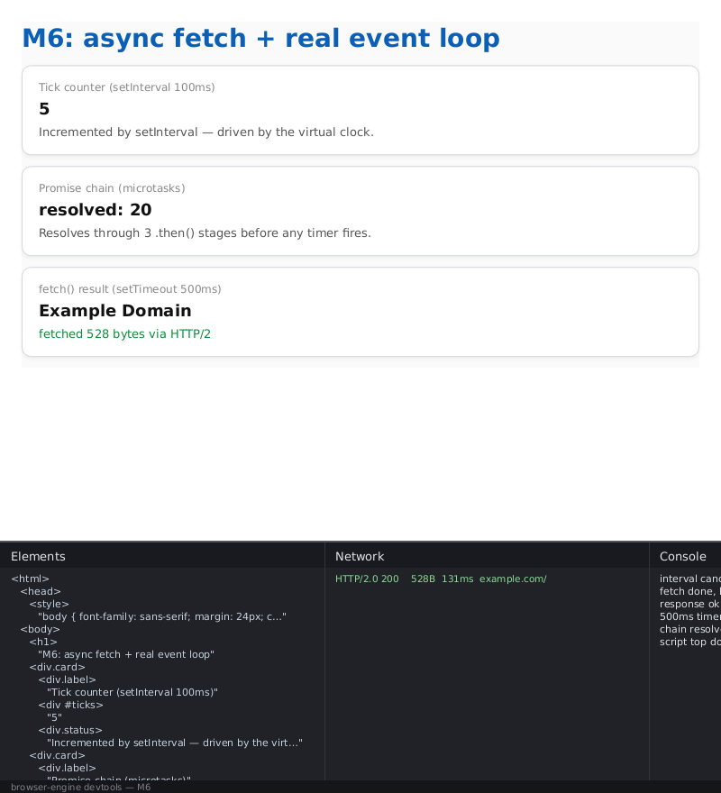

# Browser Engine

**Stack:** Rust · `html5ever` (study then replace) · custom CSS parser (`cssparser` crate) · `tiny-skia` or `wgpu` for painting · QuickJS (via `rquickjs`) for JS · `hyper` for network · Servo as reference

## Full Vision
HTML5 parser, CSS 3 cascade, flexbox + grid, compositor, JS engine integration, network stack, service workers, top-1000 sites render correctly.

## MVP (1 weekend)
Parse HTML → DOM → block layout → paint text+boxes to PNG. Supports `color`, `background-color`, `margin`, `padding`, `font-size`, `width`, `height`, `display:block|inline|none`.

## MVP Status — SHIPPED

The MVP lives in [`mvp/`](./mvp). It renders a subset of HTML + CSS directly to a PNG — no browser, no window, just pixels.

Pipeline:

```
HTML text
  → html.rs     (hand-rolled tokenizer → DOM)
  → css.rs      (selectors: tag/id/class, color/length/keyword values)
  → style.rs    (selector matching + specificity + UA stylesheet)
  → layout.rs   (block-flow box model + line-wrapped inline text)
  → paint.rs    (tiny-skia rectangles + fontdue glyph coverage blits)
  → output.png
```

### Build & run

```bash
cd mvp
cargo build --release
./target/release/browser-engine-mvp samples/hello.html samples/hello.png 800 600
```

Font is bundled (DejaVu Sans). Override with `BROWSER_FONT=/path/to/font.ttf`.

### Sample renders

| Input | Output |
|------|--------|
| [`samples/hello.html`](./mvp/samples/hello.html) |  |
| [`samples/boxes.html`](./mvp/samples/boxes.html) |  |
| [`samples/article.html`](./mvp/samples/article.html) |  |
| [`samples/cards.html`](./mvp/samples/cards.html) |  |
| [`samples/flex.html`](./mvp/samples/flex.html) |  |

### What works
- Tags: `html`, `body`, `div`, `h1–h3`, `p`, `span`, `ul`, `li`, `a`, plus `<style>` and `<!DOCTYPE>` / comments
- Attributes: `id`, `class`, inline `style=""`
- Selectors: tag, `.class`, `#id`, compound (`h1.title`), comma lists
- Specificity-ordered cascade + user-agent stylesheet
- Block layout: `margin`, `padding`, `width`, `height`, vertical stacking
- Inline layout: text wrapping on line boxes, per-word break
- Paint: solid background rectangles, glyph coverage blit with source-over alpha

### What doesn't work yet
- No grid, floats, tables, absolute positioning
- No box-shadow, images
- No scripting, no network, no forms, no events
- No real font selection / italic — single TTF with synthetic bold
- Only `px` lengths (no `em`, `%`, `rem`)

## M2 Status — SHIPPED

Richer layout + CSS. The engine now does enough to render realistic
card UIs and nav/hero flex layouts.

New in M2:
- **Borders** — `border`, `border-top`/`right`/`bottom`/`left`,
  `border-width`/`-color`/`-style`, shorthand parsing of `1px solid #333`.
  Borders sit in the box model between padding and margin and are painted
  per-side (or as a single stroke when a radius is present).
- **`border-radius`** — 1–4 values, per-corner. Backgrounds and borders
  clip to a cubic-Bezier rounded rect.
- **Flexbox-lite (`display: flex`)** — single-line. Supports
  `flex-direction: row|column`, `justify-content:
  flex-start|flex-end|center|space-between|space-around|space-evenly`,
  `align-items: flex-start|center|flex-end`, and `gap`. Flex children
  without an explicit `width` shrink to fit their content.
- **Inline layout fixes** — per-line baseline tracking so mixed-size
  inline text aligns on the baseline, whitespace collapsing that
  preserves inter-element spaces (`<strong>A</strong> b` → "A b"),
  trailing-whitespace trimming at line breaks.
- **`text-align: left|center|right`** and **`line-height`** (unitless
  multiplier or length) on block containers with inline content.
- **`font-weight`** — `bold` / numeric ≥ 600, defaults for `<b>`,
  `<strong>`, `<h1>`–`<h6>`. Synthetic-bold second pass so the bundled
  single-weight TTF still looks bold.
- **Colors** — `#rgb` / `#rrggbb` / `#rrggbbaa`, `rgb()` / `rgba()`,
  and a greatly expanded named-color table.

New samples:
- [`samples/cards.html`](./mvp/samples/cards.html) — card gallery
  exercising borders, per-side borders, dashed/solid borders, rounded
  corners, pills, bold, inline colors, line-height.
- [`samples/flex.html`](./mvp/samples/flex.html) — navbar, stats
  row and footer built with `display: flex`, `justify-content`,
  `align-items`, and `gap`.

## M3 Status — SHIPPED

Positioning, richer CSS, and real text shaping. The engine can now
render layered, drop-shadowed UI with mixed serif/sans/mono text that
kerns like a real browser.

New in M3:
- **`rustybuzz` text shaping** — pure-Rust port of HarfBuzz. Every
  inline run is shaped into glyph ids + x-advances before layout, so
  pair kerning is picked up automatically. Glyph ids flow straight
  into `fontdue::rasterize_indexed` — shaper and rasterizer agree on
  the same glyph table.
- **`font-family`** with comma-separated fallback list — resolves to
  `sans`, `serif`, or `monospace`. Three distinct TTFs are bundled so
  the rendering actually changes.
- **`font-style: italic`** with a real oblique face (DejaVu Sans
  Oblique, bundled at `assets/font-italic.ttf`). `<i>`, `<em>`,
  `<cite>`, and `<var>` default to italic.
- **Bundled bold face** — `assets/font-bold.ttf` replaces the
  synthetic-bold second pass for the sans family.
- **Positioning** — `position: relative | absolute | fixed` with
  `top`/`right`/`bottom`/`left`. Absolute boxes resolve against the
  nearest positioned ancestor's padding box; fixed boxes against the
  viewport. Out-of-flow boxes don't consume space in the normal flow.
- **`z-index`** — per-subtree stacking order when painting children,
  so later boxes can sit behind earlier ones.
- **`opacity`** — multiplicative down the tree; applies to background,
  borders, text, and shadows.
- **`box-shadow`** — single outer drop shadow with offset, blur
  (3-pass separable box blur ≈ Gaussian), spread, and color.

New samples:
- [`samples/positioned.html`](./mvp/samples/positioned.html) — a
  stage with absolutely-positioned, z-index-stacked gradient cards,
  a top-right pill badge (negative `top`, colored box-shadow), a
  monospace tag, and a 75%-opacity footer panel.
- [`samples/typography.html`](./mvp/samples/typography.html) — a
  magazine-style article exercising serif body, monospace inline
  code, italic pullquote and byline, real kerning at heading sizes,
  and drop shadows on the page + pullquote.

| Input | Output |
|------|--------|
| [`samples/positioned.html`](./mvp/samples/positioned.html) |  |
| [`samples/typography.html`](./mvp/samples/typography.html) |  |

## M5 Status — SHIPPED

The engine now talks HTTPS. Given a URL on the command line, it fetches
the document, pulls any external stylesheets and `<script src>`, warms
the image cache, and renders the result to PNG — end-to-end, no
pre-saved HTML required.

New in M5:
- **`reqwest` + `rustls`** HTTPS stack (pure-Rust TLS, no system
  OpenSSL). Up to 10 redirect hops. gzip transfer decoding.
- **In-memory cookie jar** shared across all requests on a
  single `Fetcher`, so sites that bounce through a cookie-setting
  redirect land cleanly.
- **Content-addressed on-disk cache** — `sha256(url) -> body`, stored
  under `./.netcache/<hex>.bin` with the content-type side-car in
  `<hex>.ct`. Identical URLs re-use the cached body forever (until the
  user `rm -rf`s the dir), so re-running a render is zero-network and
  hermetic.
- **Resource inlining** — walks the parsed DOM post-fetch, follows
  every `<link rel="stylesheet" href>`, appends the fetched CSS into
  the stylesheet pass, and swaps `<script src>` elements' source
  content in place so the M4 QuickJS runtime picks them up. ``
  resources are pre-fetched (cache warmed) even though the paint pass
  still draws empty boxes for them.
- **CLI accepts URLs** — `./browser-engine-mvp <url-or-file> out.png
  [w] [h]`. The URL branch runs the fetch + inline pipeline, then hands
  the same DOM off to the existing layout/paint path.

### Five real websites, rendered end-to-end

All PNGs below came from `./browser-engine-mvp <url> <png>`. No local
copies of the HTML; the engine fetched, parsed, styled, and painted
each one on a cold cache. Totals in parens are the fetched HTML body
size.

| URL | Output | Body |
|---|---|---|
| [`https://example.com`](https://example.com) |  | 528 B |
| [`https://example.org`](https://example.org) |  | 528 B |
| [`https://motherfuckingwebsite.com`](https://motherfuckingwebsite.com) |  | 4.9 KB |
| [`https://info.cern.ch`](https://info.cern.ch) |  | 646 B |
| [GitHub raw README](https://raw.githubusercontent.com/ahfoysal/browser-engine-html-css-js/main/README.md) |  | 7.4 KB |

### What doesn't work yet
- No actual image rasterization — `` still paints an empty box.
- Cookie jar is session-only (in-memory).
- No `Cache-Control` / conditional GETs; the on-disk cache is
  fetched-once-forever until you `rm -rf .netcache`.
- HTML parser is still the weekend tokenizer, so gnarly real-world
  pages (GitHub, Twitter, ...) time out or misparse. The five targets
  above were picked specifically because they're tiny and well-formed.

## M6 Status — SHIPPED

M6 upgrades the JS engine from a single-pass "run + drain FIFO" to a
proper browser-style event loop, wires up `fetch()`, turns on HTTP/2,
and adds an in-output **DevTools panel**.

New in M6:
- **Real event loop.** Every `eval` / timer / event dispatch is
  followed by a microtask drain via `rt.execute_pending_job()` so
  `Promise.then` / `.catch` / chained `.then()`s settle in spec order,
  before any macrotask runs.
- **Timers with virtual time.** `setTimeout` / `setInterval` register
  into a `TimerQueue` keyed by due-time on an accumulated virtual
  clock. `drain_tasks(max_virtual_ms)` advances the clock to each
  earliest deadline in turn, runs the callback, then drains its
  microtasks — repeat until the queue is empty or the budget is
  exceeded. That's what lets `setTimeout(..., 500)` actually "happen"
  in a one-shot render.
- **`queueMicrotask`, `clearTimeout`, `clearInterval`, `setInterval`.**
- **`fetch(url)`.** Returns a real `Promise<Response>` with `text()` /
  `json()` / `ok` / `status`. Body is fetched through the same Rust
  `Fetcher` used for `<link>` / `<script src>`, so cache + cookies are
  shared. The resolution is queued as a microtask so `.then()` chains
  naturally.
- **HTTP/2.** `reqwest` is built with the `http2` feature and
  `http2_adaptive_window(true)` — servers that advertise `h2` over ALPN
  speak HTTP/2, others fall back transparently. Observed in the sample
  as `HTTP/2.0 200` on `example.com`.
- **DevTools panel overlay.** Set `BROWSER_DEVTOOLS=1` and the output
  PNG gains a bottom panel split into three columns: **Elements** (the
  final DOM after JS), **Network** (one row per request with status,
  bytes, duration, protocol), and **Console** (captured `console.log`).
  Rendered straight onto the pixmap by `src/devtools.rs` with a
  fontdue coverage blit — no layout engine involved.

### Sample

```bash
cd mvp
BROWSER_DEVTOOLS=1 ./target/release/browser-engine-mvp \
  samples/m6_fetch.html samples/m6_fetch.png 800 600
```

| Input | Output |
|------|------|
| [`samples/m6_fetch.html`](./mvp/samples/m6_fetch.html) |  |

The sample fires three things in parallel: a Promise `.then` chain
(synchronous microtask resolution), a `setInterval(..., 100)` that
tick-counts 5 times and cancels itself via `clearInterval`, and a
`setTimeout(..., 500)` that calls `fetch("https://example.com/")`,
awaits its body, and writes the HTML `<title>` ("Example Domain") into
the DOM. The devtools panel shows the fetch logged as `HTTP/2.0 200
528B`.

## Milestones
- **M1 (Week 2):** HTML parser + DOM tree + CSS parser + selector matching — **DONE in MVP**
- **M2 (Week 5):** borders, border-radius, flexbox-lite, inline-layout fixes — **DONE**
- **M3 (Week 10):** rustybuzz shaping, font-family / italic, positioning, box-shadow, opacity, z-index — **DONE**
- **M4 (Week 16):** JS engine (QuickJS) + DOM bindings + events — **DONE**
- **M5 (Week 24):** Network stack (HTTPS) + renders real websites — **DONE**
- **M6 (Week 30):** real JS event loop (Promise/setTimeout) + `fetch()` + HTTP/2 + DevTools panel — **DONE**

## Key References
- "Let's build a browser engine!" (Matt Brubeck)
- Servo architecture
- CSS 2.1 spec
